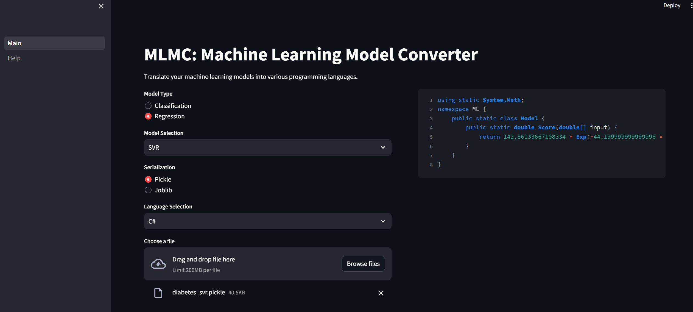

# MLMC: Machine Learning Model Converter

Translate your machine learning models into various programming languages.



## Install

The packages required to use the application are [scikit-learn](https://github.com/scikit-learn/scikit-learn), [streamlit](https://github.com/streamlit/streamlit), and [m2cgen](https://github.com/BayesWitnesses/m2cgen). You can complete the installation by specifying `requirements.txt` as follows:

```shell
$ pip install -r requirements.txt
```

> Please change the **scikit-learn** version if necessary.

## Usage

Start your application using streamlit as follows:

```shell
$ streamlit run app/Main.py
```

Then, open the default URL http://localhost:8501 in your browser.